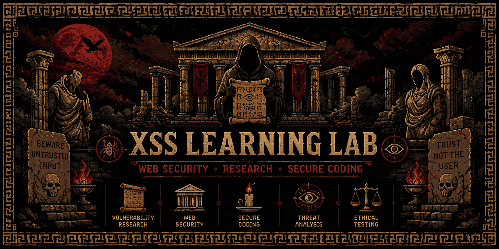

<div align="center">

# XSS LEARNING LAB

### Web Security • Research • Secure Coding




**Exploring Cross-Site Scripting (XSS) vulnerabilities, secure coding practices, and modern web application security through research, documentation, and controlled laboratory environments.**

</div>

---

## Overview

XSS Learning Lab is an educational cybersecurity project focused on understanding how Cross-Site Scripting (XSS) vulnerabilities occur and how secure development practices can prevent them.

The repository serves as a structured learning resource for students, cybersecurity enthusiasts, security researchers, and aspiring penetration testers interested in web application security.

The project emphasizes responsible security research, secure coding methodologies, vulnerability analysis, and defensive security concepts used in modern web development.

---

## Project Objectives

* Understand the fundamentals of Cross-Site Scripting (XSS)
* Study various XSS categories and attack surfaces
* Learn how insecure input handling affects applications
* Explore modern mitigation strategies
* Practice vulnerability analysis in controlled environments
* Improve secure coding knowledge
* Strengthen web application security assessment skills

---

## Topics Covered

### Reflected XSS

Understanding vulnerabilities where user-controlled input is reflected by the application and executed within the browser.

### Stored XSS

Studying scenarios where untrusted input is permanently stored and later rendered to users.

### DOM-Based XSS

Exploring vulnerabilities originating from client-side JavaScript and browser DOM manipulation.

### Event-Based Injection

Analyzing security risks associated with browser events and dynamic content handling.

### HTML5 & Modern Web Features

Reviewing security considerations related to modern browser capabilities and APIs.

### Secure Development Practices

Learning defensive programming techniques used to prevent client-side vulnerabilities.

---

## Security Concepts

* Input Validation
* Output Encoding
* Content Security Policy (CSP)
* Secure Session Management
* Browser Security Mechanisms
* OWASP Security Principles
* Defense in Depth
* Least Privilege
* Secure Development Lifecycle (SDLC)

---

## Learning Environment

The research and documentation within this repository are intended for authorized and controlled testing environments such as:

* OWASP WebGoat
* OWASP Juice Shop
* Local Development Labs
* Security Training Platforms
* Educational Sandbox Environments

---

## Skills Demonstrated

### Cybersecurity

* Web Application Security
* Vulnerability Assessment
* Threat Analysis
* Security Research
* Security Documentation

### Secure Development

* Input Validation
* Output Encoding
* Defensive Programming
* Security Testing Methodologies

### Professional Skills

* Technical Documentation
* Security Reporting
* Research Methodology
* Problem Solving

---

## Repository Structure

```text
XSS-Learning-Lab/
│
├── README.md
├── LICENSE
├── DISCLAIMER.md
│
├── Payload/
│   ├── 1. Classic Reflected XSS Payloads.md
│   ├── 2. DOM-Based XSS Payloads.md
│   ├── 3. Stored XSS Payloads.md
│   ├── 4. Event-Based XSS Payloads.md
│   ├── 5. Image-Based XSS Payloads.md
│   ├── 6. SVG-Based XSS Payloads.md
│   ├── 7. HTML5-Based XSS Payloads.md
│   ├── 8. JSONP-Based XSS Payloads.md
│   ├── 9. URL-Based XSS Payloads.md
│   ├── 10. Advanced Payloads (Stealing Cookies, Redirecting Users).md
│   ├── 11. Payloads to Bypass Filters.md
│   ├── 12. Payloads to Exploit Browser Vul.md
│   ├── 13. Payloads to Bypass CSP (Content.md
│   ├── 14. Payloads to Bypass Input Validation.md
│   ├── 15. Payloads to Bypass Output Encode.md
│   ├── 16. Payloads to Bypass Filtered Keyword.md
│   ├── 17. Payloads to Bypass Filtered Tags.md
│   ├── 18. Payloads to Bypass Filtered Attributes.md
│   ├── 19. Payloads to Bypass Filtered Characters.md
│   ├── 20. Payloads to Bypass Filtered Spaces.md    
│
├── labs/
│   ├── webgoat-lab.md
│   ├── juice-shop-lab.md
│   ├── learning-notes.md
│   └── recommendations.md
│
└── images/
    └── banner.png
```

---

## Why This Project?

Many developers understand how to build web applications but have limited exposure to client-side security vulnerabilities.

This repository was created to bridge that gap by combining security research, educational documentation, and secure development practices into a structured learning resource.

The primary goal is to promote secure coding awareness and responsible cybersecurity education.

---

## Future Improvements

* Additional OWASP Top 10 Coverage
* Secure Coding Examples
* Web Security Checklists
* Browser Security Research Notes
* Security Assessment Methodologies
* Defensive Coding Demonstrations

---

## Disclaimer

This repository is intended strictly for educational, research, and authorized security testing purposes.

All demonstrations and learning activities should be performed only on systems owned by you or systems for which explicit authorization has been granted.

The author does not support or encourage unauthorized testing, misuse, or illegal activities.

---

## Author

## 👨‍💻 Author

<p align="center">
  
</p>

<p align="center">
  <b>Vrunal Patil</b><br>
  Computer Science Student<br>
  Raspberry Pi & Cyber Security Enthusiast
</p>

---

<div align="center">

### "Understanding Vulnerabilities is the First Step Toward Building Secure Systems."

⭐ If you found this repository useful, consider starring it.

</div>
